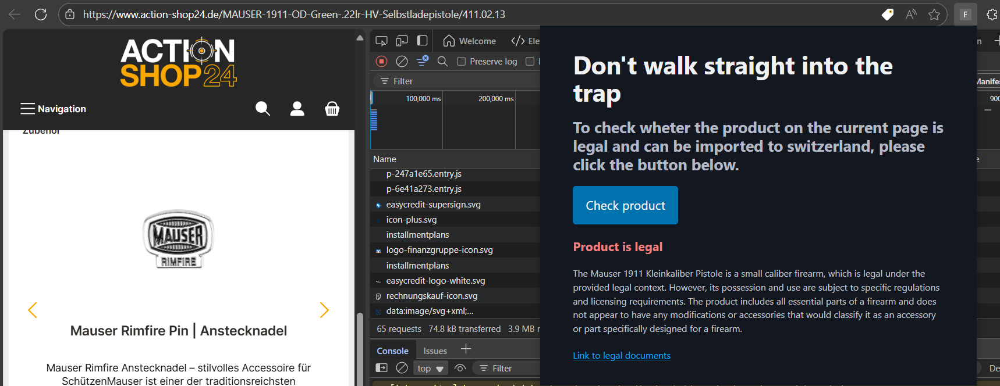

<!-- footer:  -->

# **Don't fall into the trap (Gov3)**

Stay safe and compliant while online shopping

---

<!-- Excitedly waiting for your new Blaster Master 4000! Only to find customs to reject the package. Worst case, they're even sending you a letter with legal actions. -->

---

--- 

<!-- 
- That's were we come in. 
- Input 
  - as easy as possible: WebExtension vs WebApp
  - Sanitation (HTML, strip down)
- API
  - currently URLs
  - extendable
- Extraction
  - Use LLM with sanitized input
  - Get structure output: product description, category, product identification number
- Legality Check
  - (Curated) FEDLEX catalogue as vectors (Swiss Legal Guidelines)
  - Query relevant documents
  - RAG approach: Use LLM to provide confidence regarding product legality in context of the retrieved documents
-->

---

  <a href="https://www.srf.ch/news/schweiz/onlinehandel-besuch-beim-zoll-wie-sich-kunden-verbotene-waren-liefern-lassen">SRF: Besuch beim Zoll: Wie sich Kunden verbotene Waren liefern lassen</a>

<!--
- over 600 products in one week! (679)
-->

---

# Q & A

